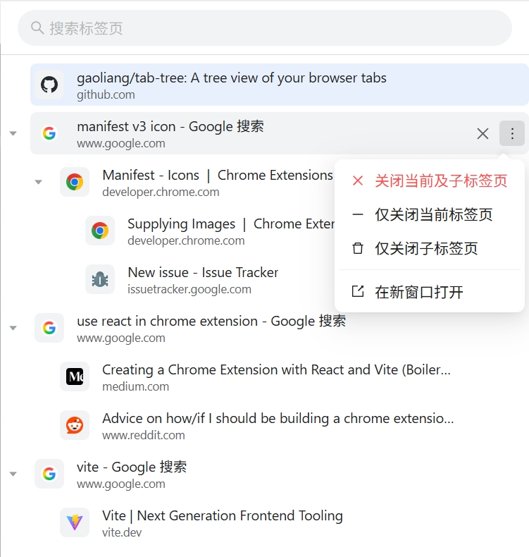

# Tab Tree

[](https://github.com/gaoliang/tab-tree)
[](https://chromewebstore.google.com/detail/tab-tree/fkpiebfdeocdoofjfhmaidhhbkmbfgjl)

[中文](#-tab-tree-标签页树) | [English](#-tab-tree)

**Tab Tree** is a Chrome extension that automatically organizes your browser tabs into a tree structure based on their opening relationships. It helps you manage large numbers of browsing tasks efficiently.



## ✨ Features

*   **🌲 Automatic Tree Structure**: Automatically builds hierarchy based on the opener tab, restoring your browsing path.
*   **🎨 Chrome Native Style**: Polished UI design that blends perfectly with the Chrome browser visual experience.
*   **🔍 Real-time Search**: Quickly filter the tab tree by title or URL keywords.
*   **⚡ Powerful Batch Operations**:
    *   **Close Tree**: One-click to close a tab and all its descendants.
    *   **Close Children Only**: Keep the parent page but clean up all derived pages.
    *   **Move to New Window**: Extract the current tab tree to a separate window to focus on the task.
*   **👀 Visual Aids**: Clear indentation guide lines and Favicon support.

## 🚀 Installation

### Option 1: Chrome Web Store
[Install from Chrome Web Store](https://chromewebstore.google.com/detail/tab-tree/fkpiebfdeocdoofjfhmaidhhbkmbfgjl)

### Option 2: Manual Installation (Developer Mode)
1. Download the source code from [GitHub Repository](https://github.com/gaoliang/tab-tree).
2. Run `npm install` in the project root to install dependencies.
3. Run `npm run build` to build the project.
4. Open Chrome and go to `chrome://extensions/`.
5. Enable "Developer mode" in the top right.
6. Click "Load unpacked" and select the `dist` directory.

## 🛠️ Local Development

Built with React + Vite + Ant Design.

```bash
# Install dependencies
npm install

# Start dev server (HMR supported)
npm run dev

# Build for production
npm run build
```

## 📝 Usage

*   **Click Tab**: Switch to the corresponding tab.
*   **Hover Actions**:
    *   Click <kbd>❌</kbd>: Quickly close the current tab and all its children (High frequency).
    *   Click <kbd>...</kbd>: Open menu for more actions (Close current only, Close children only, Move to new window).
*   **Collapse/Expand**: Click the arrow on the left to toggle sub-trees.

---

# Tab Tree 标签页树

**Tab Tree** 是一款能够自动整理浏览器标签页层级关系的 Chrome 扩展。它能将平铺的标签页自动转化为树状结构，帮助你更高效地管理大量的浏览任务。

## ✨ 核心功能

*   **🌲 自动树状结构**：根据标签页的打开来源（Opener）自动构建层级关系，还原浏览路径。
*   **🎨 Chrome 原生风格**：精心打磨的 UI 设计，完美融入 Chrome 浏览器视觉体验。
*   **🔍 实时搜索过滤**：支持通过标题或 URL 关键词快速筛选标签页树。
*   **⚡ 强大的批量操作**：
    *   **关闭当前及子标签页**：一键关闭某个任务下的所有相关页面。
    *   **仅关闭子标签页**：保留父页面，清理所有衍生页面。
    *   **在新窗口打开**：将当前标签树提取到独立窗口，专注当前任务。
*   **👀 视觉辅助**：清晰的层级缩进辅助线，支持 Favicon 显示。

## 🚀 安装使用

### 方式一：从 Chrome 应用商店安装
[点击前往 Chrome 应用商店安装](https://chromewebstore.google.com/detail/tab-tree/fkpiebfdeocdoofjfhmaidhhbkmbfgjl)

### 方式二：手动安装（开发者模式）
1. 下载本仓库源码：[GitHub Repository](https://github.com/gaoliang/tab-tree)。
2. 在项目根目录运行 `npm install` 安装依赖。
3. 运行 `npm run build` 进行构建。
4. 打开 Chrome 浏览器，进入 `chrome://extensions/`。
5. 开启右上角的“开发者模式”。
6. 点击“加载已解压的扩展程序”，选择项目下的 `dist` 目录。

## 🛠️ 本地开发

本项目基于 React + Vite + Ant Design 开发。

```bash
# 安装依赖
npm install

# 启动开发服务器（支持热更新）
npm run dev

# 构建生产版本
npm run build
```

## 📝 交互说明

*   **点击标签**：跳转到对应标签页。
*   **悬停操作**：
    *   点击 <kbd>❌</kbd> 按钮：快速关闭当前及所有子标签页（高频操作）。
    *   点击 <kbd>...</kbd> 按钮：展开更多操作菜单（仅关闭当前、仅关闭子标签、移动到新窗口）。
*   **折叠/展开**：点击左侧箭头可折叠/展开子树。

## 📄 License

MIT
